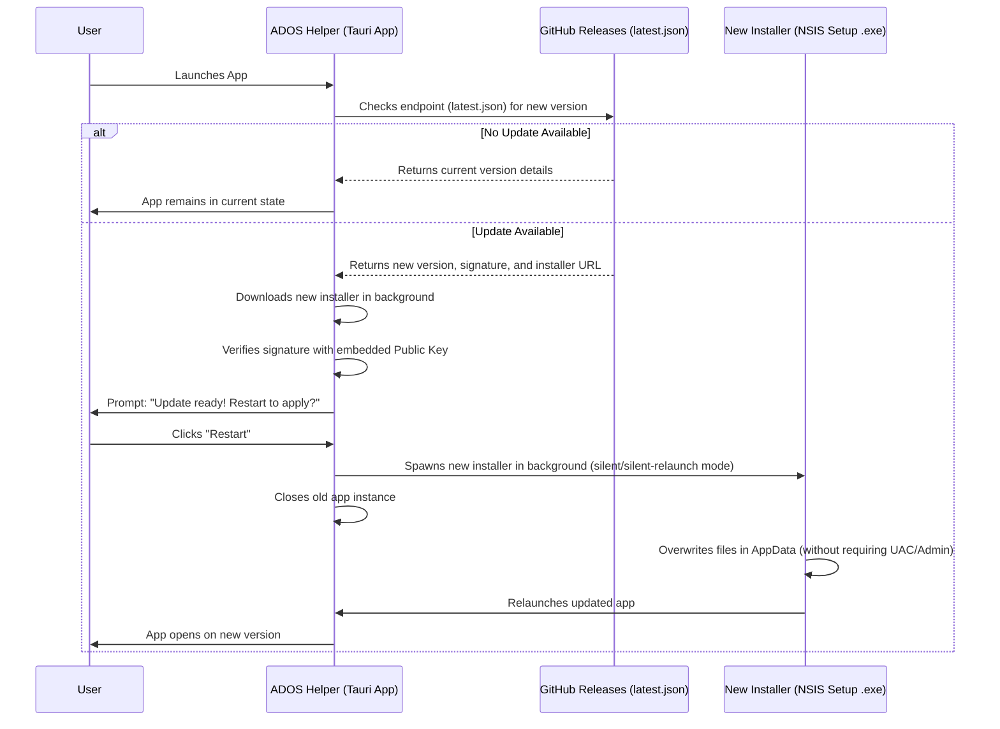

# Frictionless Auto-Updates in Tauri (Windows)

This document details the recommended implementation plan for supporting auto-updates in the **ADOS Helper** Windows application with minimal user friction.

---

## 🎯 The Strategy: One-Click NSIS Installer

To minimize user friction, you want a single file from GitHub that "just runs, opens the app, and keeps itself up to date." 

While a **portable executable** (a bare `.exe`) seems like the simplest solution, Windows locks running executables, making it difficult to replace themselves during an update. Additionally, Tauri's built-in updater plugin has **no native support** for updating bare portable executables.

### The Solution: One-Click NSIS Installer
Tauri's **NSIS One-Click Installer** (`-setup.exe`) provides the exact frictionless experience you want:
1. **Single File Download**: The user downloads a single installer `.exe` from GitHub Releases.
2. **Instant & Silent Setup**: Running the installer installs the app silently to the user's local directory (`LocalAppData/Programs/`) and launches it **instantly**. No dialogs, no installation screens, and **no administrative privileges** required.
3. **Seamless Auto-Updates**: Tauri's updater plugin can automatically check for updates, download the next installer version, run it silently in the background, and restart the app.

---

## 🔄 End-to-End Update Flow



---

## 🛠️ Implementation Steps

### Step 1: Generate Tauri Signing Keys
The Tauri updater requires update bundles to be signed with an Ed25519 key pair to prevent tampering.

Run the following command on your local development machine:
```bash
npx tauri signer generate -w ~/.tauri/ados-helper.key
```
This generates:
- A **Private Key**: Kept secure. You will save this in GitHub Repository Secrets.
- A **Public Key**: Publicly shareable. You will embed this in your `tauri.conf.json`.

---

### Step 2: Install Tauri Plugins & Dependencies
You need the Tauri Updater and Process control plugins.

1. **Frontend dependencies** (Run in project root):
   ```bash
   pnpm add @tauri-apps/plugin-updater @tauri-apps/plugin-process
   ```

2. **Backend dependencies** (Add to [Cargo.toml](file:///root/ados-helper/src-tauri/Cargo.toml)):
   ```toml
   [dependencies]
   tauri-plugin-updater = "2"
   tauri-plugin-process = "2"
   ```

---

### Step 3: Configure `tauri.conf.json`
Update [tauri.conf.json](file:///root/ados-helper/src-tauri/tauri.conf.json) to enable update creation, configure updater endpoints, add your public key, and set NSIS options.

```json
{
  "bundle": {
    "createUpdaterArtifacts": true,
    "windows": {
      "nsis": {
        "oneClick": true,
        "installMode": "currentUser"
      }
    }
  },
  "plugins": {
    "updater": {
      "pubkey": "YOUR_PUBLIC_KEY_GENERATED_IN_STEP_1",
      "endpoints": [
        "https://github.com/archerax/ados-helper/releases/latest/download/latest.json"
      ]
    }
  }
}
```

> [!IMPORTANT]
> - `oneClick: true` ensures the installation is silent and fast.
> - `installMode: "currentUser"` ensures the installer doesn't request administrative (UAC) elevation, keeping it frictionless.
> - The endpoint URL points to the direct download of `latest.json` in the latest GitHub Release of your repository.

---

### Step 4: Register Plugins in Rust
Modify [lib.rs](file:///root/ados-helper/src-tauri/src/lib.rs) to initialize the updater and process plugins.

```rust
// ... existing imports ...

#[cfg_attr(mobile, tauri::mobile_entry_point)]
pub fn run() {
  tauri::Builder::default()
    .setup(|app| {
      #[cfg(desktop)]
      {
        app.handle().plugin(tauri_plugin_updater::Builder::new().build())?;
        app.handle().plugin(tauri_plugin_process::Builder::new().build())?;
      }
      
      if cfg!(debug_assertions) {
        app.handle().plugin(
          tauri_plugin_log::Builder::default()
            .level(log::LevelFilter::Info)
            .build(),
        )?;
      }
      Ok(())
    })
    // ...
```

---

### Step 5: Update Capability Permissions
Add permissions for the updater and process plugins to [default.json](file:///root/ados-helper/src-tauri/capabilities/default.json) so the application window can check for and execute updates.

```json
{
  "$schema": "../gen/schemas/desktop-schema.json",
  "identifier": "default",
  "description": "enables the default permissions",
  "windows": ["main"],
  "permissions": [
    "core:default",
    "allow-app-commands",
    "updater:default",
    "process:default",
    "process:allow-restart"
  ]
}
```

---

### Step 6: Implement Frontend Update Checks
Add a component or hook in the React frontend that runs on startup to check for updates.

```typescript
import { useEffect, useState } from 'react';
import { check } from '@tauri-apps/plugin-updater';
import { relaunch } from '@tauri-apps/plugin-process';

export function useAutoUpdater() {
  const [updateAvailable, setUpdateAvailable] = useState(false);
  const [isUpdating, setIsUpdating] = useState(false);
  const [progress, setProgress] = useState(0);

  useEffect(() => {
    // Only check for updates in desktop (Tauri) environment
    if (!window.__TAURI_INTERNALS__) return;

    async function runUpdater() {
      try {
        const update = await check();
        if (update) {
          setUpdateAvailable(true);
          
          // Download and install automatically in the background
          setIsUpdating(true);
          
          let downloaded = 0;
          let contentLength = 0;

          await update.downloadAndInstall((event) => {
            switch (event.event) {
              case 'Started':
                contentLength = event.data.contentLength || 0;
                break;
              case 'Progress':
                downloaded += event.data.chunkLength;
                if (contentLength > 0) {
                  setProgress(Math.round((downloaded / contentLength) * 100));
                }
                break;
              case 'Finished':
                break;
            }
          });

          // Prompt the user or automatically relaunch
          // For absolute minimal friction: relaunch automatically when ready
          await relaunch();
        }
      } catch (error) {
        console.error('Failed to run update check:', error);
      } finally {
        setIsUpdating(false);
      }
    }

    runUpdater();
  }, []);

  return { updateAvailable, isUpdating, progress };
}
```

---

### Step 7: Automate Releases via GitHub Actions
Update your CI/CD setup to compile, sign, and build the `latest.json` release bundle automatically whenever you create a version tag.

Create/modify a release workflow (e.g. `.github/workflows/tauri-release.yml`):

```yaml
name: Tauri Release

on:
  push:
    tags:
      - 'v*.*.*'

jobs:
  publish:
    permissions:
      contents: write
    strategy:
      fail-fast: false
      matrix:
        include:
          - platform: 'windows-latest' # Build for Windows

    runs-on: ${{ matrix.platform }}
    steps:
      - name: Checkout Code
        uses: actions/checkout@v6

      - name: Setup Node.js
        uses: actions/setup-node@v6
        with:
          node-version: lts/*

      - name: Setup Rust
        uses: dtolnay/rust-toolchain@stable

      - name: Install Packages
        run: |
          npm i -g corepack@latest
          corepack enable
          pnpm install

      - name: Build and Publish
        uses: tauri-apps/tauri-action@v2
        env:
          GITHUB_TOKEN: ${{ secrets.GITHUB_TOKEN }}
          TAURI_SIGNING_PRIVATE_KEY: ${{ secrets.TAURI_SIGNING_PRIVATE_KEY }}
          TAURI_SIGNING_PRIVATE_KEY_PASSWORD: ${{ secrets.TAURI_SIGNING_PRIVATE_KEY_PASSWORD }}
        with:
          tagName: v__VERSION__
          releaseName: 'Release v__VERSION__'
          releaseBody: 'Automated release of ADOS Helper'
          releaseDraft: false
          prerelease: false
```

#### GitHub Secrets Checklist:
To authorize the builds, navigate to **Settings > Secrets and variables > Actions** in your GitHub repository and add:
1. `TAURI_SIGNING_PRIVATE_KEY`: Paste the contents of your generated private key file (`ados-helper.key`).
2. `TAURI_SIGNING_PRIVATE_KEY_PASSWORD` (Optional): The password you set for your private key, if any.
