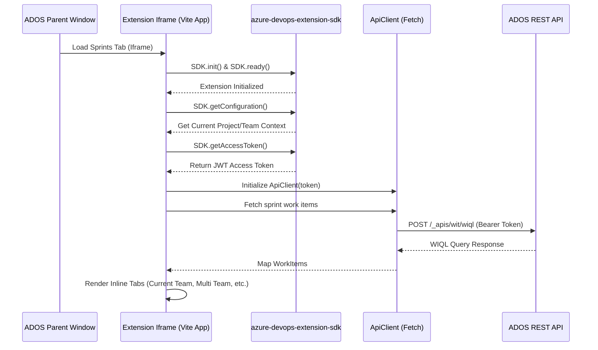

# Feasibility Study & Implementation Plan: ADOS Extension

This document evaluates the feasibility of converting **ados-helper** into an official Azure DevOps (ADOS) extension and details the implementation plan based on our resolved architecture choices.

---

## 🔍 Feasibility Verdict: Highly Feasible

Integrating the application as a native ADOS extension is **fully feasible** with minimal changes to the core components. While sandboxing prevents direct manipulation of ADOS page DOM, the target architecture leverages native iframe integration points to render the dashboard inline, creating a seamless and premium user experience.

### Architecture Overview

Below is the interaction flow between the parent ADOS frame, our extension iframe, the ADOS SDK, and the REST APIs:



---

## 🛠️ Step-by-Step Implementation Plan

### 1. Dependency Updates

We need to add the official Microsoft Azure DevOps SDK packages to our `package.json`.

```bash
pnpm add azure-devops-extension-sdk
```

---

### 2. Extension Manifests

We will maintain two manifests: a development manifest pointing to `localhost` and a production manifest bundling all built static files.

#### Development Manifest: `vss-extension-dev.json`

This manifest specifies a base URI pointing to our local Vite server, allowing for hot-reloading.

```json
{
  "manifestVersion": 1,
  "id": "ados-helper-dev",
  "version": "1.0.0",
  "name": "ADOS Helper (Dev)",
  "description": "Local development version of ADOS Helper",
  "publisher": "YourDevPublisher",
  "targets": [
    {
      "id": "Microsoft.VisualStudio.Services"
    }
  ],
  "scopes": ["vso.work", "vso.project"],
  "baseUri": "http://localhost:5173",
  "contributions": [
    {
      "id": "sprints-reports-tab",
      "type": "ms.vss-web.tab",
      "targets": ["ms.vss-work-web.iteration-backlog-tabs"],
      "properties": {
        "name": "Reports",
        "uri": "src/extension/index.html"
      }
    }
  ]
}
```

#### Production Manifest: `vss-extension.json`

For production, we package the built files directly in the extension bundle.

```json
{
  "manifestVersion": 1,
  "id": "ados-helper",
  "version": "2.15.4",
  "name": "ADOS Helper",
  "description": "Reports and metrics helper for Azure DevOps",
  "publisher": "YourProductionPublisher",
  "targets": [
    {
      "id": "Microsoft.VisualStudio.Services"
    }
  ],
  "scopes": ["vso.work", "vso.project"],
  "files": [
    {
      "path": "dist-extension",
      "addressable": true
    }
  ],
  "contributions": [
    {
      "id": "sprints-reports-tab",
      "type": "ms.vss-web.tab",
      "targets": ["ms.vss-work-web.iteration-backlog-tabs"],
      "properties": {
        "name": "Reports",
        "uri": "dist-extension/index.html"
      }
    }
  ]
}
```

---

### 3. Vite Build Configuration: `vite.extension.config.mts`

We will create a separate configuration file to isolate the Extension build process.

```typescript
import path from "node:path";
import { defineConfig } from "vite";

export default defineConfig({
  root: path.resolve(__dirname, "src/extension"),
  base: "./",
  build: {
    outDir: path.resolve(__dirname, "dist-extension"),
    emptyOutDir: true,
    rollupOptions: {
      input: {
        extension: path.resolve(__dirname, "src/extension/index.html"),
      },
    },
  },
  resolve: {
    alias: {
      "../api/": path.resolve(__dirname, "src/shared/api/"),
      "../components/": path.resolve(__dirname, "src/shared/components/"),
      "../domain/": path.resolve(__dirname, "src/shared/domain/"),
    },
  },
});
```

---

### 4. Implementation of Core Extension Files

#### Iframe Entry HTML: `src/extension/index.html`

```html
<!DOCTYPE html>
<html lang="en">
  <head>
    <meta charset="UTF-8" />
    <title>ADOS Helper Extension</title>
  </head>
  <body>
    <div id="root"></div>
    <script type="module" src="./index.tsx"></script>
  </body>
</html>
```

#### Extension Platform Service: `src/extension/ExtensionPlatformService.ts`

This service acts as the platform driver, complying with the unified `PlatformService` interface:

```typescript
import * as SDK from "azure-devops-extension-sdk";
import type { PlatformService } from "../shared/services/PlatformService";

export class ExtensionPlatformService implements PlatformService {
  async saveFile(
    data: Uint8Array,
    filename: string,
    mimeType: string,
  ): Promise<void> {
    const blob = new Blob([data], { type: mimeType });
    const url = URL.createObjectURL(blob);
    const a = document.createElement("a");
    a.href = url;
    a.download = filename;
    document.body.appendChild(a);
    a.click();
    document.body.removeChild(a);
    setTimeout(() => URL.revokeObjectURL(url), 100);
  }

  async openExternalLink(
    url: string,
    e?: React.MouseEvent | React.KeyboardEvent,
  ): Promise<void> {
    if (e) {
      e.preventDefault();
    }
    // Using ADOS navigation service is safer inside iframes to open external tabs
    const navigationService = await SDK.getService<any>(
      "ms.vss-web.navigation-service",
    );
    if (navigationService) {
      navigationService.openNewWindow(url, "");
    } else {
      window.open(url, "_blank", "noopener,noreferrer");
    }
  }
}
```

#### Extension App Entry: `src/extension/index.tsx`

Initializes the Microsoft Extension SDK, grabs context, and mounts our React 19 tree.

```typescript
import * as React from "react";
import * as ReactDOM from "react-dom/client";
import * as SDK from "azure-devops-extension-sdk";
import { ExtensionApp } from "./ExtensionApp";

async function main() {
  await SDK.init();
  await SDK.ready();

  const container = document.getElementById("root");
  if (container) {
    const root = ReactDOM.createRoot(container);
    root.render(<ExtensionApp />);
  }
}

main().catch(console.error);
```

#### Inline Dashboard Component: `src/extension/ExtensionApp.tsx`

Renders the report dashboard tabs directly on the tab canvas instead of rendering a button and opening a modal dialog:

```tsx
import * as React from "react";
import * as SDK from "azure-devops-extension-sdk";
import { MantineProvider, Tabs } from "@mantine/core";
import { useColorScheme } from "@mantine/hooks";
import { PlatformProvider } from "../shared/context/PlatformContext";
import { ExtensionPlatformService } from "./ExtensionPlatformService";
import { CurrentTeamTab } from "../shared/components/CurrentTeamTab";
import { MultiTeamTab } from "../shared/components/MultiTeamTab";
import { WorkItemTable } from "../shared/components/WorkItemTable";
import { ApiClient } from "../shared/api/ApiClient";
import { QueryClient } from "../shared/api/query/QueryClient";
import { WorkItemClient } from "../shared/api/workItems/WorkItemClient";

const platformService = new ExtensionPlatformService();

export const ExtensionApp = () => {
  const [loading, setLoading] = React.useState(true);
  const [context, setContext] = React.useState<{
    collection: string;
    project: string;
    team: string;
    sprint: string;
    origin: string;
    apiClient: ApiClient;
  } | null>(null);

  const colorScheme = useColorScheme();

  React.useEffect(() => {
    async function initContext() {
      // 1. Get auth token
      const token = await SDK.getAccessToken();

      // 2. Resolve Host details
      const hostContext = SDK.getHostContext();
      const origin = hostContext.uri;
      const collection = hostContext.name;

      // 3. Resolve Project and Team context
      const teamContext = SDK.getTeamContext();
      const project = teamContext?.projectName || "";
      const team = teamContext?.teamName || "";

      // 4. Resolve the configuration context (this contains the iteration/sprint)
      const config = SDK.getConfiguration();
      // Inspecting config payload:
      const iteration = config?.iteration?.name || "Sprint 1";

      // 5. Initialize API client using Bearer Token
      // We will need a thin wrapper or interceptor around standard fetch to attach the Bearer token
      const originalFetch = window.fetch;
      window.fetch = (input, init) => {
        const headers = new Headers(init?.headers);
        headers.set("Authorization", `Bearer ${token}`);
        return originalFetch(input, { ...init, headers });
      };

      const workItemClient = new WorkItemClient(origin);
      const queryClient = new QueryClient(origin, workItemClient);
      const apiClient = new ApiClient(origin, queryClient, workItemClient);

      setContext({
        collection,
        project,
        team,
        sprint: iteration,
        origin,
        apiClient,
      });
      setLoading(false);

      // Notify host that we are loaded
      SDK.notifyLoadSucceeded();
    }

    initContext().catch((err) => {
      console.error("Failed to initialize extension context:", err);
      setLoading(false);
    });
  }, []);

  if (loading) return <div>Loading Report Context...</div>;
  if (!context)
    return <div>Failed to load context. Check ADOS console logs.</div>;

  return (
    <PlatformProvider value={platformService}>
      <MantineProvider defaultColorScheme={colorScheme}>
        <div style={{ padding: "16px" }}>
          <h2>ADOS Helper Reports</h2>
          <Tabs defaultValue="current-team">
            <Tabs.List>
              <Tabs.Tab value="current-team">Current Team</Tabs.Tab>
              <Tabs.Tab value="multi-team">Multi Team</Tabs.Tab>
              <Tabs.Tab value="work-items">Work Item Table</Tabs.Tab>
            </Tabs.List>

            <Tabs.Panel value="current-team" pt="md">
              <CurrentTeamTab
                apiClient={context.apiClient}
                collection={context.collection}
                project={context.project}
                team={context.team}
                sprint={context.sprint}
              />
            </Tabs.Panel>

            <Tabs.Panel value="multi-team" pt="md">
              <MultiTeamTab
                apiClient={context.apiClient}
                collection={context.collection}
                project={context.project}
                sprint={context.sprint}
              />
            </Tabs.Panel>

            <Tabs.Panel value="work-items" pt="md">
              <WorkItemTable
                apiClient={context.apiClient}
                collection={context.collection}
                project={context.project}
                team={context.team}
                sprint={context.sprint}
              />
            </Tabs.Panel>
          </Tabs>
        </div>
      </MantineProvider>
    </PlatformProvider>
  );
};
```

---

## 🔄 Development and Release Workflow

1. **Local Server Setup**:
   Start your development server targeting the extension files:

   ```bash
   pnpm exec vite --config vite.extension.config.mts
   ```

   This will run on `http://localhost:5173`.

2. **Marketplace Tooling**:
   Install the Visual Studio Services Multi-platform CLI:

   ```bash
   npm install -g tfx-cli
   ```

3. **Packaging the Extension**:
   To bundle the extension into a `.vsix` file (ready for uploading to the marketplace):

   ```bash
   tfx extension create --manifest-globs vss-extension-dev.json
   ```

4. **Testing in Azure DevOps**:
   - Go to the [Visual Studio Marketplace Publishing Portal](https://marketplace.visualstudio.com/manage).
   - Create a private publisher (if you don't already have one).
   - Upload the generated `.vsix` package.
   - Click the extension, choose **Share**, and share it with your target ADOS Organization.
   - Go to **Organization Settings -> Extensions** in your ADOS account, locate the extension under **Shared**, and click **Install**.
   - Navigate to the Backlogs/Sprints section. You will see a new **Reports** tab alongside your taskboard.
   - Since the dev version points to `http://localhost:5173`, any change you make in your IDE will trigger a live hot-reload inside the ADOS page iframe.

---

## ⚡ Technical Challenges & Mitigations

| Challenge             | Mitigation                                                                                                                                                                                                                                                                                                    |
| :-------------------- | :------------------------------------------------------------------------------------------------------------------------------------------------------------------------------------------------------------------------------------------------------------------------------------------------------------ |
| **Token Expiry**      | ADOS Access tokens are short-lived. We must periodically invoke `SDK.getAccessToken()` to refresh the bearer token attached to API requests before making subsequent calls.                                                                                                                                   |
| **CORS Limitations**  | By using `SDK.getAccessToken()` and attaching it to requests going to `dev.azure.com`, ADOS permits cross-origin resource requests because the token represents a valid, delegated user authorization.                                                                                                        |
| **Context Switching** | If a user switches the sprint or team using the ADOS page dropdowns without a full browser reload, we need to hook into the configuration change events. The SDK provides `SDK.register()` handlers where ADOS alerts the iframe of configuration changes, allowing us to update the React state dynamically. |
